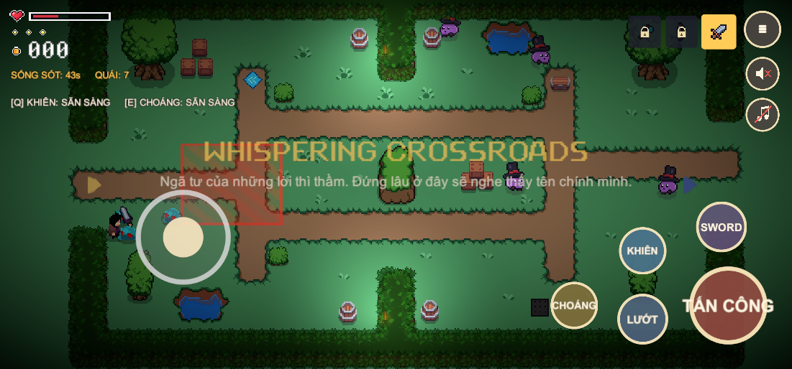

# BÁO CÁO NÂNG CẤP GAME 2D THEO TIÊU CHÍ CHẤM ĐIỂM

**Trò chơi:** SOULBOUND GATE — game hành động nhập vai 2D nhìn từ trên xuống, nền tảng Android
**Nhóm thực hiện:** Quang Ninh và Hong Phong
**Nhánh mã nguồn:** `feature/game-states-npc-ai`
**Căn cứ:** *Hướng dẫn chấm điểm đồ án môn học — Phát triển game trên Android*, mục 2.1 (sản phẩm game 2D, 5,0 điểm)

---

## Vì sao có đợt nâng cấp này

Đối chiếu game với tiêu chí chấm điểm, phần game 2D còn ba chỗ hụt:

| Tiêu chí | Chỗ hụt trước khi nâng cấp |
|---|---|
| "Có cốt truyện hấp dẫn" | Game **không kể gì cả** — chỉ có tên màn và dòng "tiêu diệt 5 quái" |
| "Demo mượt, không bị giật lag" | AI mới cấp phát bộ nhớ mỗi khung hình, nguy cơ khựng trên điện thoại |
| "Nhiệm vụ/hoàn thành cấp độ chơi có độ khó và thú vị" | 4/5 màn cùng một công thức: diệt hết quái |

Ba phần dưới đây xử lý đúng ba chỗ đó.

---

## 1. Cốt truyện

### 1a. Màn mở đầu

Bắt đầu lượt chơi mới, game vào **màn kể chuyện** (`StoryScene`) trước khi vào màn 1: ảnh key art phía
trên, bốn đoạn văn hiện dần ra từng chữ ở dưới.

Nội dung tóm tắt: vương quốc Aldmoor đã mất; Cổng Linh Hồn giữ lại linh hồn mọi người ngã xuống ở
vùng đất này; Soul Warden canh cổng và mang trên mình tất cả linh hồn nó bắt được; người chơi là
người cuối cùng cầm được Thanh Kiếm Ràng Buộc.

Hai nút điều khiển việc kể: **NHANH HƠN** (hiện hết câu đang gõ, rồi chuyển câu tiếp) và **BỎ QUA**
(vào thẳng game). Bấm phím Back của Android cũng bỏ qua.

### 1b. Lời dẫn riêng cho từng màn

Mỗi màn khi vào có một dòng giới thiệu vùng đất đó ngay dưới tên màn, thay cho dòng mục tiêu khô
khan trước đây; mục tiêu chuyển xuống thành thông báo sau đó 2,6 giây.

| Màn | Lời dẫn |
|---|---|
| 1. FORGOTTEN MEADOW | Đồng cỏ của người sống ngày trước. Giờ chỉ còn nhớt xanh bò trên nền đất cũ. |
| 2. SHADOW GROVE | Khu rừng nuốt ánh sáng. Thứ ném đá ra từ trong bóng tối đã không còn là người. |
| 3. WHISPERING CROSSROADS | Ngã tư của những lời thì thầm. Đứng lâu ở đây sẽ nghe thấy tên chính mình. |
| 4. HAUNTED MARSH | Đầm lầy giữ lại những kẻ lạc đường. Chúng vẫn đang chờ người mới tới. |
| 5. GATE OF SOULS | Cổng Linh Hồn. Soul Warden đứng đó, mang trên mình tất cả những ai nó đã giữ. |

### 1c. Đoạn kết

Hạ được Soul Warden, game kể ba đoạn kết (lớp giáp linh hồn vỡ ra, các ngọn đèn trên cổng tắt dần,
cổng khép lại vĩnh viễn) **rồi mới** hiện màn hình chiến thắng với thống kê và các nút điều hướng.

Ngoài ra, bảng **HƯỚNG DẪN** ở trang chủ có thêm mục **CỐT TRUYỆN** tóm tắt hai câu, để người chơi
đọc lại bất cứ lúc nào.

Toàn bộ chữ nghĩa nằm trong một file duy nhất (`StoryContent.cs`), tách khỏi mã giao diện.

---

## 2. Hiệu năng: bỏ rác bộ nhớ của AI

### Vấn đề

Bộ não NPC viết tuần trước dùng `Physics2D.RaycastAll` và `OverlapCircleAll` — **mỗi lần gọi trả về
một mảng mới** — và gọi mỗi khung hình: kiểm tra tầm nhìn, rồi né vật cản (tới 9 tia). Trên máy tính
không thấy gì, nhưng trên Android đây đúng kiểu làm bộ dọn rác chạy liên tục và gây khựng hình.

### Cách sửa

1. Đổi sang `RaycastNonAlloc` / `OverlapCircleNonAlloc` ghi vào **bộ đệm dùng chung** — không còn cấp
   phát mảng nào nữa.
2. Gom việc nhìn vào **một nhịp 0,1 giây** thay vì mỗi khung hình; kết quả được cả ba bộ não dùng
   chung thay vì mỗi bộ tự hỏi lại.
3. Hướng né vật cản chỉ tính lại **mỗi 0,12 giây**, hoặc khi NPC muốn đi hướng lệch quá 20°.

### Đo thực tế

Đo bằng `PerformanceSmokeTest` trong màn 3 (7 NPC, đông nhất game), 3 giây thời gian chơi:

| | Truy vấn vật lý | Mỗi NPC mỗi giây | Quy đổi 60 fps | Mảng cấp phát |
|---|---|---|---|---|
| **Trước** | 820 / giây | 117 | 1,95 / khung | ~820 mảng/giây |
| **Sau** | **122 / giây** | **17,5** | **0,29 / khung** | **0** |

Giảm **6,7 lần** số truy vấn và bỏ hẳn việc cấp phát. Bài kiểm thử đặt ngưỡng 60 truy vấn/NPC/giây để
sau này sửa code mà làm hỏng thì test báo ngay.

---

## 3. Đa dạng nhiệm vụ

Trước đây bốn màn đầu đều là "diệt hết quái rồi qua cổng". Nay mỗi vùng đất đòi một thứ khác nhau:

| Màn | Nhiệm vụ | Cách mở cổng |
|---|---|---|
| 1. FORGOTTEN MEADOW | Tiêu diệt 5 Blue Slime | Hạ con cuối cùng |
| 2. SHADOW GROVE | Tiêu diệt 5 Grape | Hạ con cuối cùng |
| 3. WHISPERING CROSSROADS | **Sống sót 45 giây** | Hết giờ — hoặc dọn sạch quái nếu đủ sức |
| 4. HAUNTED MARSH | **Tìm chìa khoá mở cổng** | Nhặt được chìa khoá; **giết hết ma cũng không mở được** |
| 5. GATE OF SOULS | Đánh bại Soul Warden | Hạ boss, kết thúc trò chơi |

**Màn 3 — sống sót:** đồng hồ đếm ngược chạy ngay khi vào màn, HUD hiện `SỐNG SÓT: 43s  QUÁI: 7`.
Nhân vật chết thì đồng hồ dừng (và lượt chơi kết thúc). Vẫn cho phép dọn sạch quái để mở cổng sớm —
ai đánh giỏi thì được thưởng, ai không thì trốn cho hết giờ.

**Màn 4 — tìm chìa khoá:** một chìa khoá vàng được đặt ở phía đối diện điểm xuất hiện, giữa đám ma.
Cổng khoá cứng cho tới khi nhặt được. Chìa khoá có id lưu trữ riêng nên đã nhặt rồi thì đi màn khác
quay lại vẫn còn mở, không mọc lại.

Công cụ đặt chìa khoá (`Tools > Soulbound Gate > Steps > Place Gate Keys`) chỉ thêm khi màn còn
thiếu, không đụng vào bố cục đã có.

---

## Danh sách file

### File mới

| File | Vai trò |
|---|---|
| `Scripts/Core/StoryContent.cs` | Toàn bộ chữ nghĩa: mở đầu, kết, lời dẫn từng màn |
| `Scripts/Menu/StoryScreenController.cs` | Màn kể chuyện, gõ chữ dần, nút nhanh hơn / bỏ qua |
| `Scripts/Levels/GateKey.cs` | Chìa khoá mở cổng ở màn 4 |
| `Scenes/StoryScene.unity` | Scene của màn kể chuyện |
| `Editor/PerformanceSmokeTest.cs` | Đo chi phí AI, có ngưỡng chống tái phạm |
| `Editor/ObjectiveSmokeTest.cs` | Kiểm thử nhiệm vụ sống sót và tìm chìa khoá |
| `Editor/Tests/StoryAndGoalTests.cs` | 6 unit test cho cốt truyện và mục tiêu màn chơi |

### File sửa chính

| File | Sửa gì |
|---|---|
| `Scripts/Enemies/NpcSenses.cs` | Bộ đệm dùng chung, không cấp phát; đếm số truy vấn để đo |
| `Scripts/Enemies/NpcBrain.cs` | Nhịp tri giác 0,1s, nhịp né vật cản 0,12s |
| `Scripts/Levels/LevelCatalog.cs` | Thêm loại mục tiêu cho từng màn |
| `Scripts/Levels/LevelManager.cs` | Xử lý ba loại mục tiêu, đồng hồ sống sót, chìa khoá |
| `Scripts/UI/GameplayRuntime.cs` | HUD hiện mục tiêu theo từng màn |
| `Scripts/Core/SceneFlow.cs` | Luồng vào/ra màn kể chuyện |
| `Scripts/Menu/GuidePanel.cs` | Thêm mục Cốt truyện |
| `Editor/LevelSceneBuilder.cs` | Tạo scene kể chuyện, đặt chìa khoá |
| `Editor/ProjectValidator.cs` | Kiểm tra scene kể chuyện và chìa khoá |

---

## Kết quả kiểm thử

| Bộ kiểm thử | Kết quả |
|---|---|
| Unit test (EditMode) — **42 test**, thêm 6 test mới | **42 / 42 đạt** |
| `ProjectValidator` — 13 scene, chìa khoá, ảnh, bộ não NPC | **Đạt hết** |
| `ObjectiveSmokeTest` (sống sót) | **Đạt hết** |
| `ObjectiveSmokeTest` (chìa khoá) | **Đạt hết** |
| `PerformanceSmokeTest` | **Đạt** — 17,5 truy vấn/NPC/giây |
| `StatesSmokeTest`, `ScreenSmokeTest`, `MenuSmokeTest`, `GameplaySmokeTest`, `MechanicsSmokeTest`, `TransitionSmokeTest` (hồi quy) | **Đạt hết** |
| `NpcBrainSmokeTest` (Grape, Ghost) | **Đạt hết** |
| Build APK | **Thành công, 0 lỗi biên dịch** |

Vài số liệu đáng chú ý do máy ghi lại:

- **Sống sót:** vào màn đồng hồ ở 43,5s và đếm xuống; giữa chừng cổng vẫn khoá; hết giờ thì cổng mở
  và lần hoàn thành được ghi vào lịch sử.
- **Chìa khoá:** dọn sạch cả 4 con ma → **cổng vẫn khoá** (đúng thiết kế); nhặt chìa khoá → cổng mở,
  màn được đánh dấu hoàn thành, chìa khoá biến mất khỏi bản đồ.
- **Hiệu năng:** 7 NPC trong màn 3 chỉ tốn 122 truy vấn vật lý mỗi giây, không cấp phát mảng nào.

---

## Còn lại gì so với tiêu chí

| Việc | Thuộc tiêu chí | Ghi chú |
|---|---|---|
| Báo cáo Word/PDF đúng khuôn (trang bìa, mục lục, danh mục hình/bảng, tài liệu tham khảo) | 1 — Định dạng báo cáo (1,0 đ) | Chưa làm, để sau |
| Quay video demo chạy trên máy thật | 2.1 — "demo mượt" | Nên quay sau khi cài bản APK mới |
| Đo FPS trên điện thoại thật | 2.1 — "demo mượt" | Bản build hiện tại đã bỏ phần cấp phát gây khựng |
