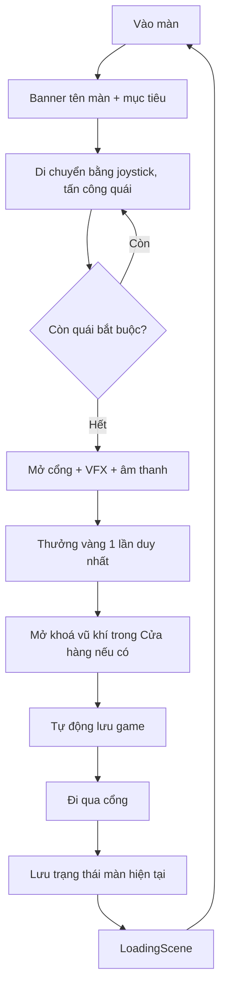
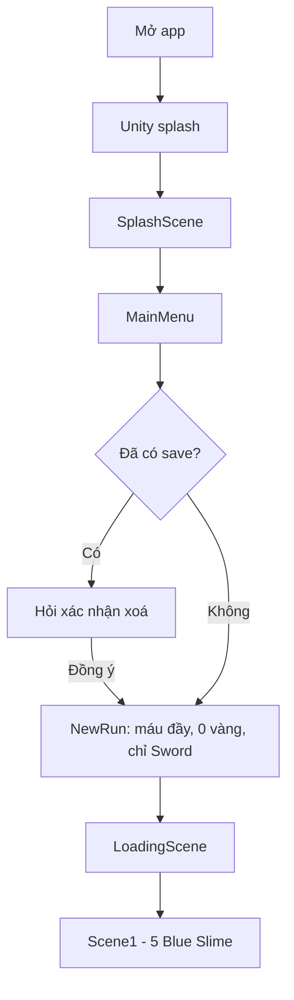
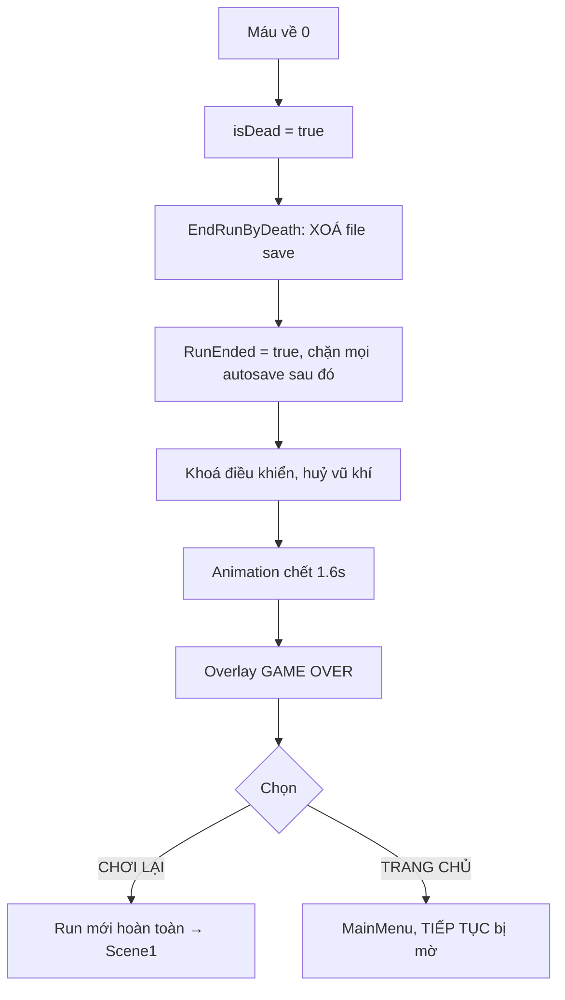
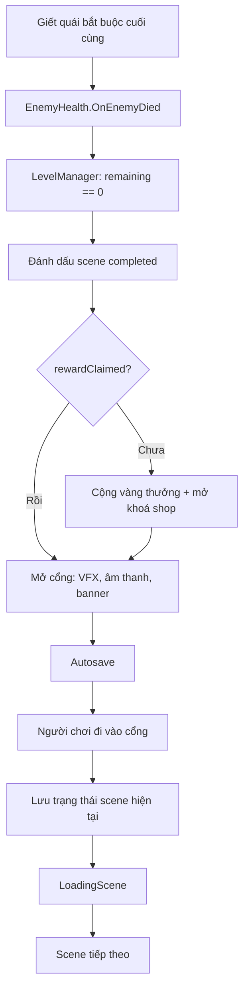

# BÁO CÁO TRIỂN KHAI — SOULBOUND GATE

**Thể loại:** 2D Top-Down Action RPG
**Nền tảng:** Android (Landscape) — vẫn chơi được bằng chuột/bàn phím trong Unity Editor
**Engine:** Unity 2022.3.3f1, URP 2D, Input System 1.6.3, Cinemachine 2.9.7
**Nhà phát triển:** Developed by Quang Ninh and Hong Phong
**Package:** `com.quangninhhongphong.soulboundgate`

---

## 1. Giới thiệu Soulbound Gate

Soulbound Gate là một game hành động nhập vai góc nhìn từ trên xuống, được phát triển
trên nền một project Unity 2D có sẵn và mở rộng thành một sản phẩm Android hoàn chỉnh.

Người chơi điều khiển một chiến binh đi qua năm khu vực nối tiếp nhau, mỗi khu vực bị
một cánh cổng linh hồn phong ấn. Cổng chỉ mở khi toàn bộ quái vật trong khu vực bị tiêu diệt.
Chặng cuối là phòng của boss **Soul Warden**.

Điểm nhấn thiết kế: **một lượt chơi (run) là một mạng duy nhất**. Chết là mất toàn bộ tiến độ,
nên mỗi quyết định tiêu vàng hay lao vào đánh đều có sức nặng.

## 2. Thể loại game

- **Chính:** Action RPG / Top-down combat
- **Phụ:** Roguelite nhẹ (chết là mất run, không có checkpoint)
- **Cấu trúc:** Tuyến tính có thể quay lui (Scene1 ↔ Scene2 ↔ ... ↔ Scene5)
- **Phiên chơi:** khoảng 15–25 phút cho một run hoàn chỉnh

## 3. Cốt truyện ngắn

> Cổng Linh Hồn — *Soulbound Gate* — từng là ranh giới giữa thế giới người sống và
> cõi bên kia. Khi phong ấn rạn vỡ, lũ quái vật tràn qua và chiếm lấy năm vùng đất
> nối liền tới Cổng.
>
> Mỗi vùng đất bị một phong ấn khóa lại, chỉ tan khi máu của kẻ chiếm đóng cuối cùng đổ xuống.
> Ở tận cùng, **Soul Warden** — kẻ gác cổng — đang chờ.
>
> Bạn là người cuối cùng còn đứng vững. Bạn chỉ có một mạng.

Các màn được đặt tên theo hành trình đó:

| Màn | Tên hiển thị | Ý nghĩa |
|---|---|---|
| Scene1 | FORGOTTEN MEADOW | Đồng cỏ bị lãng quên — nơi bắt đầu |
| Scene2 | SHADOW GROVE | Rừng bóng tối |
| Scene3 | WHISPERING CROSSROADS | Ngã tư thì thầm |
| Scene4 | HAUNTED MARSH | Đầm lầy ma ám |
| Scene5 | GATE OF SOULS | Cổng Linh Hồn — phòng boss |

## 4. Gameplay loop



Vòng lặp phụ: **giết quái → nhặt vàng → về MainMenu → mua vũ khí trong Cửa hàng → quay lại mạnh hơn.**

## 5. Điều khiển Android

| Vị trí | Nút | Chức năng |
|---|---|---|
| Nửa dưới bên trái | **Joystick nổi** | Di chuyển. Đặt ngón ở đâu thì cần điều khiển hiện ra ở đó |
| Dưới phải (lớn nhất) | **TẤN CÔNG** (Ø230) | Giữ để đánh liên tục theo cooldown của vũ khí |
| Dưới phải | **LƯỚT** (Ø150) | Dash, tốn 1 stamina |
| Dưới phải | **VŨ KHÍ** (Ø150) | Cycle qua các vũ khí **đã sở hữu** |
| Trên phải | **☰** (Ø110) | Tạm dừng |
| Trên phải | 3 ô vũ khí | Sword / Bow / Staff — ô chưa mua bị tối và có hình ổ khoá |

Toàn bộ nằm trong `SafeArea`, tự co giãn theo `Screen.safeArea`, nên notch hay thanh
điều hướng không che mất nút nào. Mọi nút đều lớn hơn nhiều so với mức 48dp tối thiểu.

**Trong Editor vẫn giữ nguyên điều khiển PC:** WASD, chuột trái tấn công, Space dash, phím 1/2/3 đổi vũ khí.

## 6. Player

`Assets/Prefabs/Scene Management/Player.prefab`

| Thành phần | Vai trò |
|---|---|
| `PlayerController` | Di chuyển, dash, lật sprite, bật/tắt điều khiển |
| `PlayerAimController` | **Mới** — nguồn duy nhất quyết định hướng nhắm |
| `PlayerHealth` | Máu, nhận sát thương, luồng chết |
| `Stamina` | Stamina và hồi stamina |
| `Knockback`, `Flash` | Phản hồi khi trúng đòn |
| Con: `Active Weapon` | Trục xoay vũ khí (`ActiveWeapon` + `MouseFollow`) |
| Con: `Weapon Collider` | Vùng sát thương của kiếm (`DamageSource`) |

Player tồn tại xuyên scene bằng `DontDestroyOnLoad`, và bị dọn sạch khi rời trận về menu
(`SceneFlow.LeaveGameplay`) để menu không có nhân vật lang thang.

## 7. Health

- Máu tối đa mặc định **3**, hiển thị bằng `Health Slider` ở góc trên trái
- Có thời gian bất tử ngắn sau khi trúng đòn (`damageRecoveryTime = 1s`)
- Khi trúng đòn: rung màn hình + nhấp nháy trắng + knockback + rung máy nhẹ (nếu bật)
- Máu về 0 → `isDead = true` → xoá save → animation chết → màn hình Game Over
- Có thể hồi máu bằng vật phẩm rơi ra hoặc mua **HỒI MÁU** 5 vàng trong Cửa hàng

## 8. Stamina

- Mặc định **3** điểm, hiển thị bằng dãy icon ở góc trên trái
- Mỗi lần Dash tốn **1** stamina
- Tự hồi 1 điểm mỗi 3 giây khi chưa đầy (`RefreshStaminaRoutine`)
- Nhặt Stamina Globe hồi ngay 1 điểm

Điểm sửa đáng chú ý: bản gốc dùng `StopAllCoroutines()` để quản lý vòng hồi stamina —
điều này giết cả các coroutine khác trên cùng object. Bản mới giữ tham chiếu tới đúng
coroutine đó.

## 9. Gold / Economy

`EconomyManager` được mở rộng thành manager đầy đủ:

```csharp
public int CurrentGold { get; }
public void AddGold(int amount);
public bool CanAfford(int amount);
public bool SpendGold(int amount);   // trả về false nếu không đủ, không bao giờ âm
public void SetGold(int value);
public static event Action<int> OnGoldChanged;
```

Hàm cũ `UpdateCurrentGold()` được giữ lại (gọi `AddGold(1)`) để **prefab Gold Coin không phải sửa**.

Thưởng khi hoàn thành màn — **chỉ nhận một lần**, chống farm bằng cách đi tới đi lui:

| Màn | Thưởng |
|---|---|
| Scene1 | +10 vàng |
| Scene2 | +20 vàng |
| Scene3 | +25 vàng |
| Scene4 | +30 vàng |

Cờ `SceneStateData.rewardClaimed` nằm trong file save nên còn hiệu lực qua cả lần chơi sau.

## 10. Weapon

| Vũ khí | Sát thương | Cooldown | Tầm | Ghi chú |
|---|---|---|---|---|
| Sword | 1 | 0.5s | cận chiến | Sở hữu sẵn, miễn phí |
| Bow | 1 | 0.7s | 12 | Mua 10 vàng sau khi clear Scene1 |
| Staff | 2 | 1.2s | 8 | Mua 20 vàng sau khi clear Scene2 |

**Magic Laser là đạn của Staff, không phải vũ khí thứ tư.**

`ActiveInventory` được refactor thành hệ thống sở hữu vũ khí thật:
tham chiếu trực tiếp ba `WeaponInfo` asset thay vì phụ thuộc thứ tự child của dải 5 ô UI cũ
(dải cũ được giữ trong prefab nhưng ẩn bằng `CanvasGroup.alpha = 0`).
`CycleWeapon()` bỏ qua vũ khí chưa mua.

## 11. Shop

Nằm trong MainMenu (`ShopPanel`). Ba mặt hàng: Bow, Staff, Hồi máu (5 vàng).

Trạng thái hiển thị của mỗi mặt hàng:

| Điều kiện | Hiển thị |
|---|---|
| Chưa clear màn yêu cầu | "Hoàn thành Màn N để mở khóa." — nút KHÓA |
| Đã mở, đủ vàng | Giá + nút MUA |
| Đã mở, không đủ vàng | Giá + nút MUA bị mờ |
| Đã mua | "ĐÃ SỞ HỮU" |
| Hồi máu khi máu đầy | "Máu đã đầy (3/3)" — nút mờ |
| Không có run nào | Vàng = 0, mọi thứ khóa |

Mua hàng ghi thẳng vào file save (`SaveSystem.Save`) ngay lập tức, nên tắt app sau khi mua
cũng không mất.

## 12. Enemy

| Enemy | Prefab | Hành vi |
|---|---|---|
| Blue Slime | `Enemies/Blue Slime.prefab` | Lang thang, gây sát thương khi chạm |
| Grape | `Enemies/Enemie1.prefab` | Bắn đạn theo quỹ đạo vòng cung, để lại vũng nhớt |
| Ghost | `Enemies/Ghost.prefab` | Bắn loạt đạn theo hình nón (`Shooter.cs`) |

> Prefab của Grape thực tế tên là `Enemie1.prefab` — xác minh bằng GUID của script
> `Grape.cs` (`45f3a338d8f1c8f409ac0591d5a73b71`) chứ không đoán theo tên.

`EnemyHealth` được refactor: có `OnEnemyDied` event, `PersistentId`, `IsDead`,
`CountsTowardObjective` và `RestoreHealth()` — thay vì `Destroy` thẳng như bản cũ.

## 13. Boss — Soul Warden

`Assets/Prefabs/Enemies/Boss/Soul Warden.prefab` — dựng tự động từ artwork của Ghost
nhưng khác biệt rõ rệt: **scale 2.3×**, tint tím, quầng sáng (`BossAuraPulse`) đập theo
sóng sin, bóng đổ lớn hơn, và bỏ hoàn toàn `EnemyAI`/`Shooter`/`EnemyPathfinding` chung.

**Máu: 42 HP** (Sword 1 dmg → ~42 nhát; Staff 2 dmg → 21 phát).

Ba giai đoạn:

| Giai đoạn | Máu | Hành vi |
|---|---|---|
| 1 | 100% → 65% | Di chuyển chậm, bắn nón 5 viên góc 55°, nghỉ 2.2s |
| 2 | 65% → 30% | Nhanh hơn 1.35×, nón 7 viên góc 80° + vòng tròn 10 viên, triệu hồi 2 Slime |
| 3 | < 30% | Nón 9 viên góc 100° + vòng tròn 14 viên, triệu hồi Grape và Slime, nghỉ ngắn hơn |

**Mọi đòn nguy hiểm đều có telegraph 0.45 giây** — boss nhấp nháy sang màu tím sáng trước
khi đạn xuất hiện, để người chơi kịp đọc và né trên màn hình cảm ứng.

Boss lơ lửng giữ khoảng cách ~5.5 đơn vị thay vì lao thẳng vào người chơi, luôn để chỗ né.
Đạn dùng object pool đơn giản để tránh giật GC trên Redmi 13. Minion không tính vào mục tiêu màn.

Thanh máu boss lớn ở giữa trên màn hình, có dải "vệt sát thương" chạy chậm phía sau
để mỗi cú đánh đều đọc được.

## 14. Level system

`LevelCatalog` giữ dữ liệu thiết kế của 5 màn (tên, mục tiêu, thưởng, mở khoá).
`LevelManager` (một cái mỗi scene gameplay) làm 4 việc:

1. Khôi phục trạng thái đã lưu của scene (quái đã chết, đồ đã phá, máu quái còn lại)
2. Khôi phục trạng thái Player (máu, stamina, vàng, vũ khí, vị trí)
3. Đếm quái bắt buộc và lắng nghe `EnemyHealth.OnEnemyDied` — **không** quét `FindObjects` mỗi frame
4. Khi quái cuối cùng chết: mở cổng, thưởng vàng, mở shop, autosave

### Số lượng quái bắt buộc (đã được validator xác minh)

| Scene | Quái | Đã kiểm chứng |
|---|---|---|
| Scene1 | 5 Blue Slime | ✅ |
| Scene2 | 5 Grape | ✅ |
| Scene3 | 3 Blue Slime + 4 Grape = 7 | ✅ |
| Scene4 | 4 Ghost | ✅ |
| Scene5 | 1 Soul Warden | ✅ |

## 15. Gate system

Mỗi cổng là một `AreaExit`. Hướng của cổng được suy ra tự động bằng cách so số thứ tự màn:
cổng dẫn tới màn **cao hơn** là cổng tiến (phải clear mới mở), cổng dẫn về màn thấp hơn
**luôn mở**.

| Trạng thái | Biểu hiện |
|---|---|
| Khóa | Hạt cổng và ánh sáng chuyển xanh lạnh, mờ; đi vào hiện "CỔNG BỊ KHÓA - CÒN n QUÁI VẬT" |
| Mở | Hạt và ánh sáng chuyển vàng ấm; banner "CỔNG ĐÃ MỞ!" + âm thanh |

`OnTriggerStay2D` cũng được xử lý, nên đứng sẵn trong cổng rồi giết con quái cuối cùng
là đi qua được ngay, không cần bước ra bước vào.

## 16. Save / Continue

JSON trong `Application.persistentDataPath`, **không dùng PlayerPrefs cho save game**
(PlayerPrefs chỉ giữ âm lượng, rung và kỷ lục).

**Ghi an toàn (atomic):** ghi ra file `.tmp` rồi `File.Replace` — mất điện giữa chừng
không để lại file save hỏng, và bản `.bak` sinh ra từ lần replace trước dùng làm dự phòng.

API: `HasValidSave()`, `SaveGame()` (`SaveRun`), `LoadGame()` (`LoadRun`), `DeleteSave()` (`DeleteRun`), `NewGame()` (`NewRun`).

### Nội dung file save

| Nhóm | Trường |
|---|---|
| Player | scene hiện tại, X/Y, máu hiện tại/tối đa, stamina hiện tại/tối đa, vàng, vũ khí đang cầm, thời gian chơi |
| Sở hữu | ownsSword / ownsBow / ownsStaff, shopBowUnlocked / shopStaffUnlocked |
| Tiến độ | highestUnlockedLevel, bossDefeated, runActive, runCompleted |
| Boss | bossCurrentHealth, bossPhase |
| Mỗi scene | completed, rewardClaimed, gateOpen, visited, danh sách object đã bị xoá, máu còn lại của từng quái |

`saveVersion = 1`; file có version khác sẽ bị từ chối thay vì áp dụng nửa vời.

### Khi nào tự động lưu

Bấm LƯU GAME · chuyển scene · Về Trang Chủ · `OnApplicationPause(true)` · `OnApplicationFocus(false)` · `OnApplicationQuit`.

Nhưng **chỉ lưu khi** `Player tồn tại && !isDead && currentHealth > 0 && !RunEnded`.
Cờ `RunEnded` được bật ngay lúc chết, chặn mọi callback đến sau ghi đè lại file vừa bị xoá —
đây chính là race condition mà đề bài lưu ý.

## 17. Scene persistence

Hệ thống `PersistentObjectId`: mỗi quái và mỗi vật phá được mang một GUID ổn định,
sinh trong Editor (`Scene1:enemy:0`, `Scene3:prop:2`, ...) và **không đổi giữa các lần chạy**.
Không dựa vào `GameObject.name` vì tên có thể trùng.

Nhờ đó, đi Scene1 → Scene2 → quay lại Scene1:

- 5 con Slime đã giết **không** hồi sinh
- Bụi/thùng đã phá **không** xuất hiện lại
- Cổng vẫn ở trạng thái mở
- Thưởng 10 vàng **không** được nhận lần hai
- Quái chưa chết giữ đúng lượng máu còn lại

Vì quái đã chết không hồi sinh nên vàng chúng rơi ra cũng không thể farm lại.

## 18. Main Menu

Bố cục 3 phần trên nền động (`MenuBackground` — cổng phát sáng, các dải núi trượt
parallax, tàn lửa bay lên):

- **Trái:** nhân vật Player, chạy 12 frame idle thật, có bob/scale/nghiêng nhẹ theo sóng sin
- **Giữa:** logo SOULBOUND GATE + 6 nút (CHƠI MỚI, TIẾP TỤC, CỬA HÀNG, HƯỚNG DẪN, CÀI ĐẶT, THOÁT GAME)
- **Phải:** một quái vật của game (6 frame idle), lật ngược để nhìn vào giữa, lệch pha 1.9s so với Player

Cả hai nhân vật là **object hiển thị thuần tuý** (`Image` + `SpriteSequenceAnimator`) —
**không** instantiate prefab Player gameplay, tránh tạo singleton và cướp input của menu.

**CHƠI MỚI** khi đã có save sẽ hỏi xác nhận *"Bắt đầu trò chơi mới? Dữ liệu lưu hiện tại sẽ bị xóa."*
**TIẾP TỤC** chỉ bấm được khi `HasValidSave()` đúng — nếu không thì mờ đi.
Nút **Back** của Android ở màn hình chính hỏi *"Thoát game?"* trước, không thoát ngay:
thoát chỉ vì một cú chạm lỡ thì người chơi không phân biệt được với việc app bị crash.

> **Lỗi đã sửa sau lần build đầu:** nền động được tạo *sau* vùng safe area nên uGUI vẽ nó
> **đè lên** toàn bộ menu — người chơi chỉ thấy nền, không thấy logo và nút.
> Đã đưa nền về `SetAsFirstSibling()`. Kèm theo đó, `MenuBackground` giờ dùng `SafeBounds()`:
> nếu canvas báo kích thước 0 ở frame đầu, phép chia cũ tạo ra giá trị vô cực, và một
> phần tử UI kích thước vô cực khiến Unity dựng lưới sort vô hạn rồi crash vì hết bộ nhớ.
> Cả hai đều được `Menu Smoke Test` kiểm chứng tự động.

## 19. Loading

`LoadingScene` nằm giữa **mọi** lần chuyển scene gameplay. Dùng `LoadSceneAsync` với
`allowSceneActivation = false`, hiển thị tiêu đề, "Đang tải...", thanh tiến độ, phần trăm
và một mẹo chơi ngẫu nhiên trong 10 mẹo.

Thanh tiến độ lấy **giá trị nhỏ hơn** giữa tiến độ thật và tiến độ theo thời gian tối thiểu
(0.9s) — không fake tiến độ, cũng không nháy qua quá nhanh.

## 20. Pause

Bấm ☰ (hoặc nút Back của Android): `Time.timeScale = 0`, khóa điều khiển, hiện bảng
**TẠM DỪNG** với CHƠI TIẾP / LƯU GAME / CÀI ĐẶT / VỀ TRANG CHỦ / THOÁT GAME.

Nút LƯU GAME tự mờ khi không đủ điều kiện lưu. `Time.timeScale` được đưa về 1 ở **ba** chỗ:
khi đóng menu, trong `OnDisable` phòng trường hợp panel bị huỷ, và trong `GameBootstrap.OnSceneLoaded`
mỗi lần scene mới nạp xong.

## 21. Audio

`AudioManager` (persistent) với 1 nguồn nhạc + 6 nguồn SFX luân phiên.
Clip nạp theo tên từ `Resources/Audio/` — thiếu clip thì im lặng chứ không `NullReferenceException`.

- **Nhạc nền (4):** Menu, Level, Boss, Victory — có crossfade
- **Hiệu ứng (18):** UI click, sword swing, bow shot, staff shot, projectile, player hurt/death,
  enemy hurt/death, coin/health/stamina pickup, gate open, dash, boss attack, victory, purchase, denied

**Toàn bộ âm thanh do script tự sinh** (`Assets/Editor/PlaceholderAudioGenerator.cs`) từ
sóng vuông/tam giác/nhiễu, viết ra file WAV 16-bit — *Generated specifically for this project*,
không dùng bất kỳ tài nguyên có bản quyền nào. Nhạc nền được crossfade ở điểm nối vòng lặp
nên không nghe thấy tiếng "cạch" khi lặp.

## 22. Mobile UI

- `CanvasScaler` = Scale With Screen Size, tham chiếu **1920×1080**, `matchWidthOrHeight = 1`
  (khớp chiều cao — hợp lý cho game landscape, màn rộng hơn chỉ hiện thêm bề ngang)
- `SafeArea.cs` bám theo `Screen.safeArea`, tự cập nhật khi xoay máy
- Không hardcode toạ độ tuyệt đối; mọi thứ neo theo anchor
- Nút bấm co nhẹ khi chạm (`ButtonPressFeedback`) — màn cảm ứng không có trạng thái hover
- Chữ tiếng Việt dùng font hệ thống, tiêu đề tiếng Anh dùng font pixel **Gixel**
  (Gixel chỉ có ASCII, dùng cho tiếng Việt sẽ mất hết dấu)

## 23. Unity Input System

Giữ nguyên `Player Controls.inputactions` (Movement.Move, Combat.Attack, Combat.Dash,
Inventory.Keyboard) để **không phá bàn phím/chuột trong Editor**.

Input cảm ứng đi qua lớp static `MobileInput` mà `PlayerController`, `PlayerAimController`
và `ActiveWeapon` cùng đọc. `MobileInput.ResetAll()` được gọi khi đổi scene, khi pause và
khi app mất focus — nếu không, một ngón tay đang giữ lúc scene đổi sẽ khiến nhân vật chạy
mãi mà không có cách nào dừng.

### Hệ thống nhắm (mục VI của đề bài)

Trước đây `PlayerController`, `Sword`, `Staff`, `MagicLaser`, `MouseFollow` **mỗi cái tự đọc
`Input.mousePosition`**. Giờ tất cả đọc từ một `PlayerAimController` duy nhất:

| Nền tảng | Cách xác định hướng |
|---|---|
| Desktop | Hướng từ Player tới con trỏ chuột |
| Mobile | Quái còn sống gần nhất trong bán kính 9 đơn vị (quét 0.15s/lần, không quét mỗi frame) |
| Không có mục tiêu | `LastFacingDirection` — hướng di chuyển gần nhất |

Với Sword, auto-aim rất nhẹ: chỉ hỗ trợ khi quái đã nằm trong bán kính 2.5 và lệch dưới 70°
so với hướng đang quay — đủ để không hụt oan, không đủ để game tự chơi hộ.

Một lỗi đã được sửa nhân tiện: trước đây `MouseFollow` **và** `Sword`/`Staff` cùng ghi vào
một transform trục vũ khí mỗi frame, tranh nhau. Giờ chỉ `MouseFollow` xoay trục.

## 24. Android build

| Cấu hình | Giá trị |
|---|---|
| Product Name | Soulbound Gate |
| Company Name | Quang Ninh and Hong Phong |
| Bundle ID | `com.quangninhhongphong.soulboundgate` |
| Orientation | AutoRotation, chỉ Landscape Left + Right |
| Scripting backend | IL2CPP |
| ABI | **ARM64 + ARMv7** |
| Min SDK | 24 · Target SDK | Auto (32) |
| Graphics API | Vulkan, OpenGLES3 |
| Render outside safe area | Bật (UI tự giữ trong safe area) |
| Keystore | Debug (đủ cho bài tập lớn) |

**App icon** sinh từ chính sprite Player của game
(`spr_player_right_idle`, frame idle đầu tiên), phóng to bằng nearest-neighbour để
**không làm nhoè pixel art**, đặt giữa nền gradient tím-đen với vòng rune vàng.
Xuất cả 3 biến thể: Legacy, Round và Adaptive (foreground + background riêng),
Filter Mode = Point.

## 25. Kiến trúc script

```
Assets/Scripts/
├── Core/          GameScenes, GameBootstrap, SceneFlow, GameMessages,
│                  PersistentObjectId, LoadingTips
├── Save/          SaveData, SaveSystem, GameSaveManager, ProfileStats
├── Levels/        LevelCatalog, LevelManager, LevelCameraAnchor
├── Player/        PlayerController, PlayerAimController, PlayerHealth, Stamina,
│                  ActiveWeapon, Sword, Projectile, DamageSource, SlashAnim
├── UI/            PixelUI, GameplayRuntime, PauseMenuUI, GameOverUI, SettingsPanel,
│                  BossHealthBarUI, SafeArea, ButtonPressFeedback, HoldToAttack,
│                  GameArtLibrary, WeaponIcons, WeaponType, ActiveInventory,
│                  Bow, Staff, Magic Laser, MouseFollow, WeaponInfo, InventorySlot
├── Menu/          MainMenu, ShopPanel, GuidePanel, SplashScreenController,
│                  LoadingScreenController, VictoryScreenController,
│                  MenuBackground, MenuArt, MenuFloatAnimation, SpriteSequenceAnimator
├── Audio/         AudioManager, GameSfx
├── Boss/          BossController, BossHealth, BossAuraPulse, VictorySequence
├── Enemies/       EnemyAI, EnemyHealth, EnemyPathfinding, Grape, Shooter, ...
├── Management/    SceneManagement, AreaExit, AreaEntrance, CameraController, UIFade, Singleton
├── Misc/          EconomyManager, Destructible, Knockback, Flash, Haptics, Light2DTint, ...
└── Mobile/        MobileInput, OnScreenJoystick
```

### Nguyên tắc thiết kế

**1. UI dựng bằng code.** Toàn bộ HUD cảm ứng, Pause, Game Over, Shop, Guide, Settings,
Splash, Loading, Victory được dựng bằng C# theo đúng pattern mà project đã có sẵn.
Không phải sửa YAML scene/prefab một cách rủi ro, và mọi layout nằm ở một chỗ đọc được.

**2. Giao tiếp bằng event, không quét mỗi frame.**
`EnemyHealth.OnEnemyDied`, `Destructible.OnDestructibleDestroyed`, `PlayerHealth.OnPlayerDied`,
`EconomyManager.OnGoldChanged`, `ActiveInventory.OnWeaponChanged`, `GameMessages.OnBanner/OnToast`.
Tất cả đều huỷ đăng ký trong `OnDisable`/`OnDestroy`.

**3. Bootstrap tự cài.** `GameBootstrap` chạy qua `[RuntimeInitializeOnLoadMethod]`,
nên bấm Play từ **bất kỳ** scene nào cũng chạy được — kể cả Scene3 giữa chừng khi đang test.

**4. Null-check phòng thủ.** Mọi `GameObject.Find` trong code mới đều kiểm tra null trước
khi `GetComponent`. Ba chỗ NRE tiềm tàng trong code gốc (`PlayerHealth.UpdateHealthSlider`,
`Stamina.Start`, `EconomyManager.UpdateCurrentGold`) đã được sửa.

**5. Chống trùng singleton.** `SceneFlow.LeaveGameplay()` dọn Player / UICanvas / Managers /
Camera Controller / Economy / ScreenShake khi rời trận, nên không bao giờ có 2 Player,
2 EventSystem hay 2 UICanvas sau khi quay lại từ menu.

## 26. Danh sách scene

| Build index | Scene | Nội dung |
|---|---|---|
| 0 | SplashScene | Màn hình tên game + tên nhóm phát triển |
| 1 | MainMenu | Trang chủ, Shop, Hướng dẫn, Cài đặt |
| 2 | LoadingScene | Màn hình tải chung |
| 3 | Scene1 | FORGOTTEN MEADOW — 5 Blue Slime |
| 4 | Scene2 | SHADOW GROVE — 5 Grape |
| 5 | Scene3 | WHISPERING CROSSROADS — 3 Slime + 4 Grape |
| 6 | Scene4 | HAUNTED MARSH — 4 Ghost |
| 7 | Scene5 | GATE OF SOULS — Soul Warden |
| 8 | VictoryScene | Tổng kết run |

Game Over được làm bằng **overlay canvas** chứ không phải scene riêng — sạch hơn vì không
phải giữ trạng thái qua một lần load scene nữa, và hiện được ngay sau animation chết.

Scene1/Scene2 gốc đã sao lưu tại `Assets/Scenes/Backup/`.

## 27. Danh sách prefab quan trọng

| Prefab | Ghi chú |
|---|---|
| `Scene Management/Player.prefab` | Player, có thêm `PlayerAimController` |
| `Scene Management/UICanvas.prefab` | HUD gốc; `ActiveInventory` đã gắn 3 WeaponInfo |
| `Scene Management/Managers.prefab` | SceneManagement, CameraController, ScreenShake, Economy |
| `Scene Management/Camera.prefab` | Cinemachine, giờ chạy ở chế độ camera cố định |
| `Enemies/Blue Slime.prefab` | Quái màn 1 và 3 |
| `Enemies/Enemie1.prefab` | **Grape** — quái màn 2 và 3 |
| `Enemies/Ghost.prefab` | Quái màn 4 |
| `Enemies/Boss/Soul Warden.prefab` | **Mới** — boss màn 5 |
| `Weapons/{Sword,Bow,Staff,Arrow,Magic Laser,Bullet}.prefab` | Vũ khí và đạn |
| `AreaExit.prefab` | Cổng, dùng làm mẫu khi tool tạo cổng mới |

Asset sinh tự động: `Resources/UI/GameArtLibrary.asset`, `Resources/Audio/**` (22 file WAV),
`Generated/UI/SoulboundGate_AppIcon*.png`, `Generated/UI/SoulWardenAura.png`.

## 28. Flow diagram

### Luồng chơi mới



### Luồng chết



### Luồng clear màn



## 29. Test cases

### Kiểm thử tự động — 16/16 PASS

`Assets/Editor/Tests/` (Unity Test Framework, EditMode):

| Nhóm | Test |
|---|---|
| `SaveSystemTests` | Không có save = không Continue được; save round-trip qua đĩa; run đã chết không continue được; run đã thắng không continue được; xoá save là xoá cả bản backup; save sai version bị từ chối; file save hỏng không ném exception |
| `ProgressionTests` | Run mới chỉ có Sword; Bow chỉ mở sau Scene1; Staff chỉ mở sau Scene2; giá 0/10/20; thưởng 10/20/25/30; mỗi scene khớp catalog; scene menu không bị coi là gameplay; scene đã clear giữ nguyên trạng thái khi quay lại; máu từng quái lưu riêng theo id |

Chạy lại: `Unity.exe -batchmode -runTests -testPlatform EditMode`

### Kiểm thử cấu trúc — `Tools > Soulbound Gate > Validate Project` — PASS

Kiểm tra Build Settings đúng 9 scene đúng thứ tự; đủ số quái mỗi màn; mọi quái có
persistent id và **không trùng id**; mỗi scene có Player/Managers/UICanvas/Camera/
LevelManager/camera anchor; tilemap nền và tường không rỗng; mỗi scene có cổng;
đủ asset sinh tự động (22 file audio, art library, icon, boss prefab).

Kết quả lần chạy cuối:

```
Scene1: 5 quái (đúng 5) · Scene2: 5 (đúng 5) · Scene3: 7 (đúng 7)
Scene4: 4 (đúng 4) · Scene5: 1 (đúng 1)
RESULT: all checks passed.
```

### Kiểm thử thủ công

Xem `MANUAL_TEST_CHECKLIST.md` — 32 mục.

## 30. Hướng phát triển tiếp

1. **Object pooling toàn diện** — hiện chỉ đạn của boss được pool; áp dụng cho mọi đạn
   và VFX sẽ giảm thêm GC spike trên máy yếu.
2. **Thêm boss phụ** ở Scene3 hoặc Scene4 để nhịp độ đa dạng hơn.
3. **Nâng cấp vĩnh viễn** (máu tối đa, stamina tối đa) mua bằng vàng tích luỹ qua nhiều run —
   `maxHealth`/`maxStamina` đã có sẵn trong SaveData.
4. **Nhiều slot save** — `SaveSystem` chỉ cần tham số hoá tên file.
5. **Bản đồ mini** hoặc chỉ báo hướng tới cổng.
6. **Localization** tiếng Anh/tiếng Việt — hiện chuỗi đang nằm trực tiếp trong code.
7. **Bảng xếp hạng online** cho thời gian hoàn thành (`ProfileStats` đã lưu best time cục bộ).
8. **Nhạc thật thay cho nhạc sinh bằng script** — chỉ cần thả file đúng tên vào
   `Resources/Audio/`, không phải sửa code.
9. **Vibration theo cường độ** — hiện có 2 mức (nhẹ/mạnh) qua JNI.
10. **Điều chỉnh độ khó** trong Cài đặt cho người chơi mới.

---

## Phụ lục — Kết quả build

| Hạng mục | Kết quả |
|---|---|
| Compile | **0 lỗi** |
| EditMode tests | **16/16 pass** |
| Validate Project | **all checks passed** |
| Menu smoke test | **all checks passed** (`Tools > Soulbound Gate > Debug > Menu Smoke Test`) |
| APK | `Builds/Android/SoulboundGate.apk` — **43 MB** |
| Package | `com.quangninhhongphong.soulboundgate` |
| ABI trong APK | `arm64-v8a`, `armeabi-v7a` (đã xác minh bằng `aapt`) |
| Nhãn app | `Soulbound Gate` |
| Quyền | INTERNET, **VIBRATE** |
| minSdk / targetSdk | 24 / 32 |
